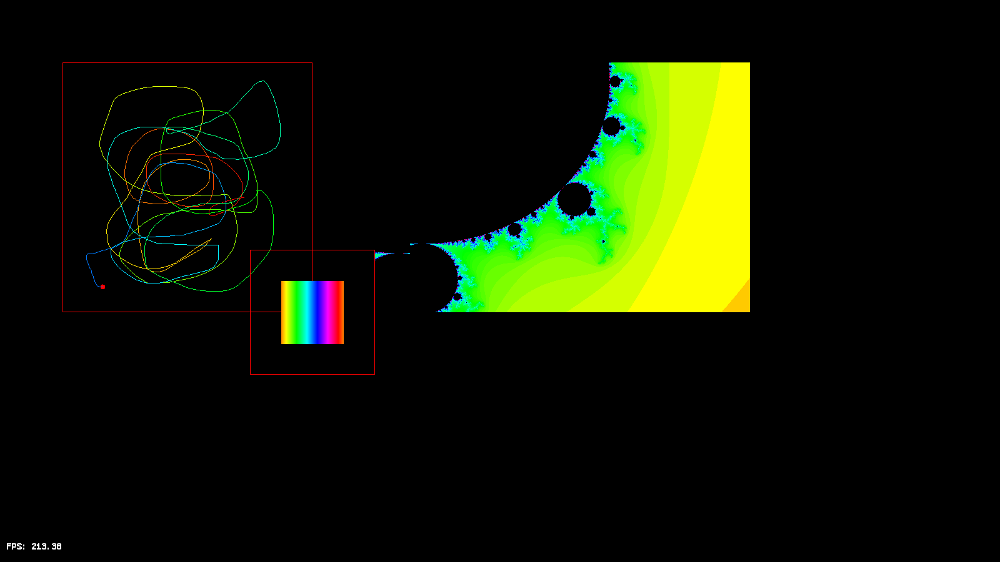
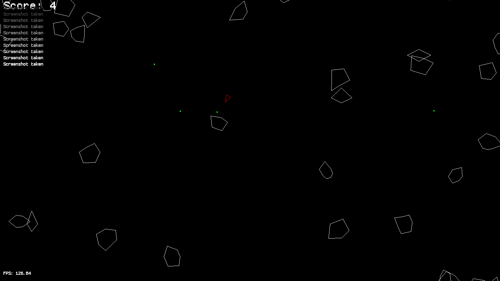

# fui

fui, standing for framebuffer user interface, is a C library for interacting with the framebuffer in a tty context. It writes directly to the framebuffer device, using a system of layers for drawing. Some stuff that it does:

- Draws pixel values to an arbitrary number of layers, which are then composited together and rendered to the framebuffer.
- Primitive drawing functions for lines, rectangles, and circles.
- Text rendering using a bitmap font.
- Event handling for keyboard and mouse input (using libevdev), with a more generic event system implemented that can be used for other events.
- A cheeky sound system using alsa that can play sine tones and chords for now.

## Installation

The actual librar is in `fui`, and can be compiled and installed with:

```bash
make
sudo make install
```

The library can then be used by including `-Lfui -l:libfui.a` in your compiler flags. The library is statically linked, so you don't need to worry about shared libraries.  

## Examples

There are some (half-baked for now) examples included, in the `examples` folder. `main.c` and `bodies.c` kind of demonstrates most of the components of the library. In the `asteroids` folder we have a simple asteroids game, which uses the sound system. Also, in `tests`, there are a few tests implemented using cmocka.

<p align="center">
  
</p>
<p align="center"><em>Some stuff running with fui (from main.c).</em></p>

<p align="center">
  
</p>
<p align="center"><em>Asteroids!</em></p>